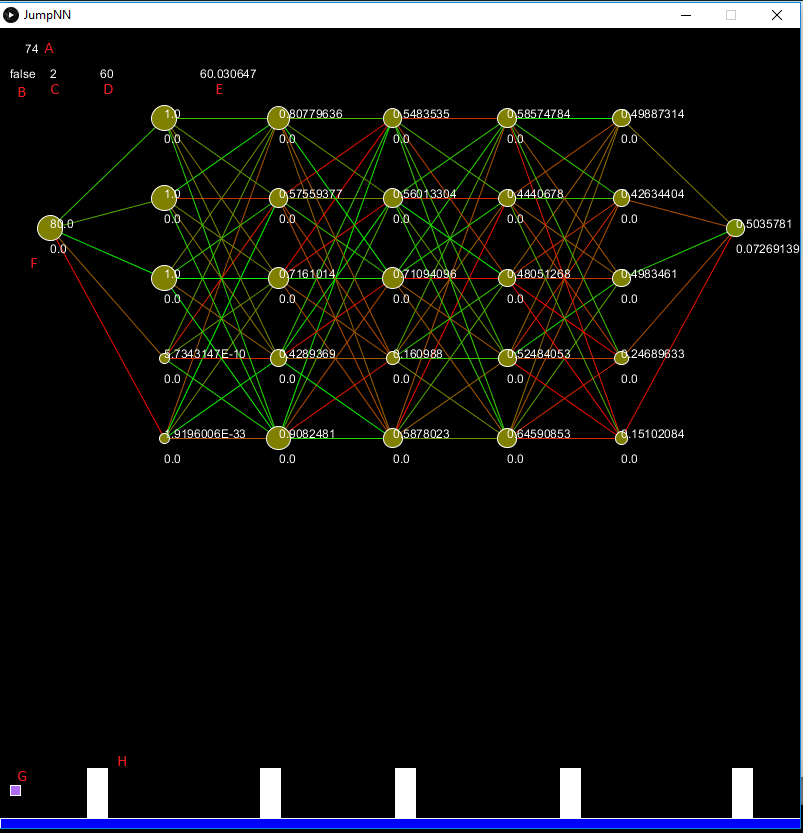

# JumpNN
This project was an experiment to applying a simple neural network to a player to achieve a simple goal. Each player must jump over the obstacles to survive. If a player touches an obstacle, the player is killed. When all players are killed a new generation will be created.

To create a new generation and ensure the players will continue to evolve toward the goal, the best performing players will be chosen. The fittest players are given another chance and will be bred 9 times (single parent) for a total of 10 players per fittest player. This will ensure that a bad mutation will not ruin the chances of breading a successful generation.

## Getting Started
This project relies on processing with the Java plugin.
https://processing.org/
Simply opening the files with processing and pressing run is all that is required to run.
This code was written using processing 3.3.7

## Visuals Explained  
  
A - The current number of living players  
B - Whether or not turbo mode is enabled  
C - Current generation  
D - Target framerate  
E - Actual framerate  
F - The visual representation of the brain (inputs on the left, outputs on the right)  
G - The players  
H - The obstacles

## Videos

